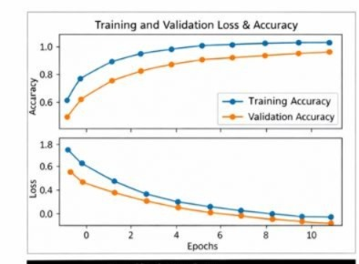
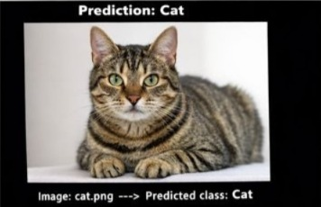
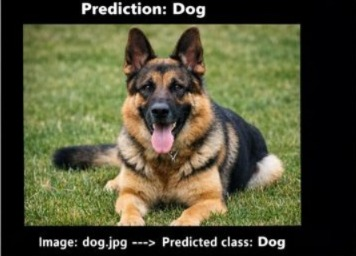

# Image Classification using CNN

This is an easy beginner Computer Vision project using CNN.

## Features
- Classifies images as Cat or Dog
- Uses Convolutional Neural Network (CNN)

## Technologies
Python, TensorFlow, OpenCV

## How to Run
1. Install requirements
2. Run train.py
3. Run predict.py

## Output

### Predicted Result

